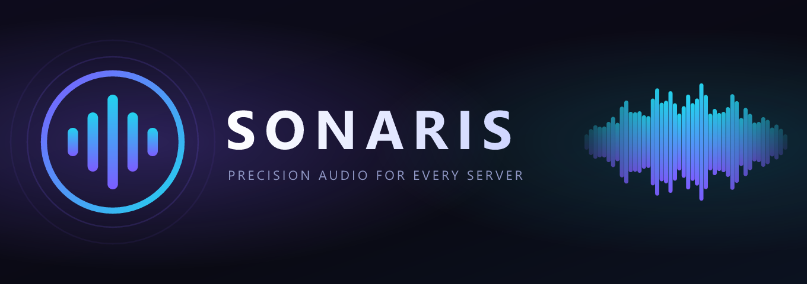

<div align="center">


# Sonaris

**Precision audio for every server.**

A premium Discord music bot with YouTube, SoundCloud and Spotify support, a live control panel,
audio filters, autoplay and per-server settings. Built on Lavalink, ready for Windows Server.




</div>

---

## Contents

[Features](#features) · [Music sources](#music-sources) · [Screenshots](#screenshots) · [Commands](#commands) ·
[Control panel](#the-control-panel) · [Tech stack](#tech-stack) · [Project structure](#project-structure) ·
[Requirements](#requirements) · [Installation](#installation) · [Discord bot setup](#discord-bot-setup) ·
[Lavalink setup](#lavalink-setup) · [Environment variables](#environment-variables) ·
[Running locally](#running-locally) · [Docker](#docker) · [Production](#production-deployment) ·
[Troubleshooting](#troubleshooting) · [Security](#security-notes) · [Contributing](#contributing) ·
[License](#license) · [Credits](#credits)

## Features

- **Everything you expect from a premium bot:** slash commands, an interactive search picker, a paginated queue,
  previous track, shuffle, loop (track / queue), seek, volume, lyrics and more.
- **A live control panel** that updates in place: play/pause, previous, skip, stop, loop, shuffle, volume, autoplay,
  a filter menu, and modals for adding songs and seeking. One message, no spam.
- **Audio filters** that are only offered when the audio server supports them: Bass Boost, Nightcore, Vaporwave, 8D,
  Karaoke, Tremolo, Vibrato.
- **Autoplay** picks a related track when the queue ends and avoids repeats.
- **Per-server settings** stored in SQLite: DJ role, default and maximum volume, idle disconnect time, default loop and
  autoplay, filter permission, a dedicated request channel with a persistent controller.
- **Careful voice rules:** members must be in the bot's channel to control it, DJ-role protection is optional, empty
  channels are left after a configurable time, and abandoned players are cleaned up.
- **Resilient by design:** reconnects to Discord and Lavalink with backoff, never crashes because Lavalink is still
  booting, survives reboots, and shows friendly errors instead of stack traces.
- **Production-ready on Windows Server:** real Windows services (auto-start, auto-restart, no open terminal), log
  rotation, a health/status script, and a one-command safe updater.
- **Secure defaults:** secrets only in `.env` and scrubbed from logs, Lavalink bound to localhost, private-network links
  blocked, download checksums verified.

## Music sources

| Source | Tracks | Playlists / albums | Search | Notes |
|--------|:------:|:------------------:|:------:|-------|
| YouTube | ✅ | ✅ | ✅ | Via the maintained `youtube-source` plugin |
| YouTube Music | ✅ | ✅ | ✅ | Default text-search source (`ytmsearch`) |
| SoundCloud | ✅ | ✅ | ✅ | Built in |
| Spotify | ✅ | ✅ (playlists, albums) | – | Needs free API credentials. Metadata from Spotify, audio mirrored from YouTube/SoundCloud |
| Bandcamp, Twitch, Vimeo | ✅ | – | – | Built in |
| Direct audio URLs (`.mp3`, `.ogg`, streams...) | ✅ | – | – | Private-network addresses are refused |

Unavailable, private or region-locked items are reported with a clear message and skipped.

## Screenshots

> **Live screenshots are not included yet.** They must come from a real Discord server, and none were taken during
> development. Once you have the bot running, capture these views and save them in [`docs/screenshots/`](docs/screenshots/):
>
> | File | What to capture |
> |------|-----------------|
> | `control-panel.png` | The live control panel while a song plays |
> | `now-playing.png` | `/nowplaying` |
> | `queue.png` | `/queue` with several pages |
> | `search.png` | `/search` results with the picker open |
> | `help.png` | `/help` category menu |
>
> Then add them here with ``.

Brand artwork (logo and banner) lives in [`branding/`](branding/BRAND.md).

## Commands

All interaction is through slash commands, buttons, menus and modals, and everything is in English. Commands only work
inside servers.

### Music

| Command | Description |
|---------|-------------|
| `/play <query> [next] [choose]` | Play a song name, YouTube / SoundCloud / Spotify link or playlist. `next` plays it right after the current track, `choose` opens the search picker. |
| `/search <query>` | Show up to 10 results (title, artist, duration, source, artwork) and pick one or several. Times out safely after 60 s. |
| `/join` / `/leave` | Join your voice channel / disconnect and end the session. |
| `/lyrics [query]` | Lyrics for the current song or a search, split into readable parts. |

### Playback

| Command | Description |
|---------|-------------|
| `/nowplaying` | Artwork, progress bar, source, requester, volume, loop, autoplay, filter and queue size. |
| `/pause` · `/resume` | Pause or resume. |
| `/skip [to]` · `/previous` | Skip (optionally to a queue position) / return to the previous track. |
| `/stop` | Stop and clear the queue (stays in the channel). |
| `/seek <time>` | `1:30`, `90`, `1m30s`, `+30`, `-15`. |
| `/volume [level]` | Show or set the volume (capped by the server maximum). |
| `/loop <mode>` | `off`, `track` or `queue`. |
| `/autoplay [enabled]` | Keep similar music going when the queue ends. |

### Queue and filters

| Command | Description |
|---------|-------------|
| `/queue [page]` | Paginated queue with durations and requesters. |
| `/remove <position> [to]` · `/move <from> <to>` | Remove a track or range / reorder tracks. |
| `/clear` · `/shuffle` | Empty or shuffle the queue. |
| `/filter <type>` | Bass Boost, Nightcore, Vaporwave, 8D, Karaoke, Tremolo, Vibrato, or clear. One filter at a time; choosing the active one turns it off. |

### Settings (Manage Server)

| Command | Description |
|---------|-------------|
| `/setup controller <channel> [messages]` · `/setup disable` | Create a persistent controller in a music channel. With `messages`, typed song names become requests. |
| `/settings view` | Show every setting. |
| `/settings dj [role]` | Set the DJ role (leave empty to turn DJ mode off). |
| `/settings volume [default] [max]` · `idle <seconds>` | Volume defaults / idle disconnect time. |
| `/settings autoplay` · `loop` · `filters` · `requests` · `reset` | Defaults for new sessions, filter permission, message requests, reset. |

### Utility

| Command | Description |
|---------|-------------|
| `/help` | Categorized help with a menu. |
| `/ping` | Gateway, round-trip and Lavalink latency. |
| `/about` | Version, developer, uptime, servers, libraries, music backend and links. |

**DJ mode is optional.** When a DJ role is set, sensitive actions (stop, leave, clear, remove, move, shuffle, volume,
seek, loop, autoplay, filters) need that role, Manage Server, or being the only listener. Everyone in the voice channel
can still play, search, pause, resume, skip, go back and view the queue.

## The control panel

The panel is a single message with a rich embed and four component rows. It is **edited in place**, never re-posted, and
updates when the track changes, playback pauses or resumes, the queue changes, or loop, autoplay, volume or filters
change. Updates are coalesced and rate limited (about one edit per 1.5 s), so bursts of changes cost one request.

```text
 ┌──────────────────────────────────────────────┐
 │ ▶ Now Playing                                │
 │ Do I Wanna Know?                             │
 │ by Arctic Monkeys                            │
 │ `1:05`  ━━━━━●━━━━━━━━━━━━  `4:32`           │
 │ ⏱ Ends in 3 minutes                          │
 │ Source · Volume · Loop · Autoplay · Filter · Queue │
 │ Up next: 1. ... 2. ... 3. ...                │
 └──────────────────────────────────────────────┘
  ⏮   ⏸   ⏭   ⏹   🔁          transport
  🔀   🔉   🔊   ♾️   📜          shuffle · volume · autoplay · queue
  [ 🎛️ Audio filters            ▾ ]             filter menu
  [ ➕ Add song ] [ ⏩ Seek ] [ 🎤 Lyrics ]       modals and lyrics
```

With `/setup controller` the same panel lives permanently in a music channel and returns to an idle state when nothing
plays, so members can request songs from there with the **Add song** button, or (optionally) by typing.

## Tech stack

- **Runtime:** Node.js 22+ (ESM), TypeScript in strict mode
- **Discord:** [discord.js](https://discord.js.org) 14 (slash commands, buttons, select menus, modals)
- **Audio:** [Lavalink](https://lavalink.dev) v4 with [lavalink-client](https://github.com/tomato6966/lavalink-client),
  the `youtube-source` and `LavaSrc` plugins
- **Storage:** SQLite through Node's built-in `node:sqlite` (no native compilation, works on a clean Windows Server)
- **Validation and logging:** zod, pino with size-based rotating files and secret scrubbing
- **Quality:** vitest, ESLint (typescript-eslint), `tsc --noEmit`
- **Deployment:** WinSW Windows services (primary), systemd, Docker Compose (optional)

## Project structure

```text
src/
  index.ts                 Entry point: startup, login retry, graceful shutdown
  app.ts                   Composition root (client, settings, Lavalink, panel, idle)
  config/                  Environment validation (zod) and brand constants
  database/                node:sqlite, migrations, per-guild settings store
  commands/                Slash commands by category (music, playback, queue, filters, settings, utility)
  interactions/            Router for buttons, menus and modals; search picker; lyrics delivery
  components/              Embeds and interactive components (control panel, queue, help)
  music/                   Player logic: actions, guards (voice/DJ), panel, autoplay, filters, search, idle, events
  services/                Lyrics providers, command deployment, presence
  utils/                   Formatting, pagination, source detection, logging, errors
  events/                  Discord gateway events
  scripts/                 checkEnv, deployCommands, smokeLavalink
tests/                     Unit tests (no Discord needed)
lavalink/                  application.yml, launcher, Lavalink README
scripts/                   Windows setup, service install/uninstall/start/stop/restart/status/update
deploy/linux/              systemd units
docs/                      Windows Server guide, deployment, troubleshooting
branding/                  Logo, banner, brand guide and image prompts
```

## Requirements

- **Node.js 22.13 or newer** (22 LTS or 24 LTS)
- **Java 17 or newer** (Lavalink)
- A Discord application with a bot token
- Outbound internet access (Discord, YouTube, SoundCloud, plugin downloads)
- Optional: Spotify API credentials, Git

## Installation

The fastest path on a Windows machine (PowerShell as Administrator, in the project folder):

```powershell
Set-ExecutionPolicy -Scope Process -ExecutionPolicy Bypass -Force
.\scripts\setup-windows.ps1      # checks Node/Java, creates .env, installs, builds, downloads Lavalink
notepad .env                     # add DISCORD_TOKEN and DISCORD_CLIENT_ID
.\scripts\setup-windows.ps1      # validates the configuration
.\scripts\install-services.ps1   # installs and starts the two Windows services
```

The complete, beginner-friendly walkthrough is in **[docs/WINDOWS-SERVER.md](docs/WINDOWS-SERVER.md)**. Linux and
Docker instructions are in **[docs/DEPLOYMENT.md](docs/DEPLOYMENT.md)**.

## Discord bot setup

1. Create an application at <https://discord.com/developers/applications>.
2. Copy the **Application ID** (`DISCORD_CLIENT_ID`) and, on the **Bot** tab, reset and copy the **token**
   (`DISCORD_TOKEN`). Leave the privileged intents off (only *Message Content* is needed for typed requests).
3. Invite the bot (replace the ID):

   ```text
   https://discord.com/oauth2/authorize?client_id=YOUR_APPLICATION_ID&scope=bot%20applications.commands&permissions=3238912
   ```

   Permissions: View Channels, Send Messages, Embed Links, Read Message History, Manage Messages, Connect, Speak.
4. Upload `branding/logo.png` and `branding/banner.png` in the Developer Portal if you like.

## Lavalink setup

Lavalink and its plugins are configured in [`lavalink/application.yml`](lavalink/application.yml) and documented in
[`lavalink/README.md`](lavalink/README.md). Highlights:

- The **YouTube plugin** replaces Lavalink's built-in YouTube source; **LavaSrc** adds Spotify. Both are downloaded by
  Lavalink on first start. Nothing to install by hand.
- Secrets (password, Spotify credentials) come from `.env` through environment variables.
- Lavalink listens on `127.0.0.1` only.

Check the whole audio backend without Discord: `npm run smoke`.

## Environment variables

Copy `.env.example` to `.env`. Values are validated at startup and every problem is reported at once.

| Variable | Required | Default | Description |
|----------|:--------:|---------|-------------|
| `DISCORD_TOKEN` | ✅ | | Bot token |
| `DISCORD_CLIENT_ID` | ✅ | | Application ID |
| `DISCORD_GUILD_ID` | | *(empty)* | Register slash commands for one server only (instant, for development) |
| `LAVALINK_HOST` / `LAVALINK_PORT` | | `127.0.0.1` / `2333` | Where the bot finds Lavalink |
| `LAVALINK_PASSWORD` | ✅ | | Shared secret, 12+ characters |
| `LAVALINK_SECURE` | | `false` | Use `wss`/`https` to reach Lavalink |
| `LAVALINK_MEMORY` | | `1G` | Java heap for Lavalink (Windows service) |
| `SPOTIFY_ENABLED` / `SPOTIFY_CLIENT_ID` / `SPOTIFY_CLIENT_SECRET` / `SPOTIFY_COUNTRY_CODE` | | `false` / empty / empty / `US` | Spotify support (used by Lavalink) |
| `YOUTUBE_OAUTH_ENABLED` / `YOUTUBE_OAUTH_REFRESH_TOKEN` | | `false` / empty | Optional YouTube sign-in workaround |
| `DEFAULT_SEARCH_SOURCE` | | `ytmsearch` | `ytmsearch`, `ytsearch` or `scsearch` |
| `MESSAGE_REQUESTS_ENABLED` | | `false` | Enables typed song requests (needs the Message Content intent) |
| `DATABASE_PATH` | | `./data/sonaris.db` | SQLite file |
| `LOG_DIR` / `LOG_LEVEL` | | `./logs` / `info` | Log location and verbosity |
| `NODE_ENV` | | `production` | `development` enables pretty console logs |
| `BOT_DEVELOPER`, `BOT_SUPPORT_URL`, `BOT_WEBSITE_URL`, `BOT_GITHUB_URL` | | | Shown in `/about` |

## Running locally

```powershell
npm install
Copy-Item .env.example .env         # fill in the token, client id, and a 12+ character LAVALINK_PASSWORD
# download lavalink\Lavalink.jar (see lavalink/README.md), then in one terminal:
powershell -ExecutionPolicy Bypass -File .\lavalink\start-lavalink.ps1
# and in another:
npm run dev
```

| Script | Purpose |
|--------|---------|
| `npm run dev` | Run from source with hot reload (development only) |
| `npm run build` | Compile to `dist/` |
| `npm start` | Run the compiled build (what production uses) |
| `npm run typecheck` · `npm run lint` · `npm test` | Quality checks |
| `npm run verify` | Repository sanity checks (docs, env, secrets) |
| `npm run check:env` | Validate `.env` |
| `npm run smoke` | Connect to Lavalink and test searches without Discord |
| `npm run deploy:commands` | Register slash commands immediately |

## Docker

Optional. The compose file runs Lavalink (private network, port not published) and the bot:

```bash
cp .env.example .env    # fill in the values
docker compose up -d --build
```

See [docs/DEPLOYMENT.md](docs/DEPLOYMENT.md#docker-compose-optional).

## Production deployment

**Windows Server is the primary target.** The scripts in [`scripts/`](scripts/) turn the project into two Windows
services, `MusicBot-Lavalink` and `MusicBot`, that start with the machine, restart after failures and need no open
terminal:

| Task | Command (elevated PowerShell) |
|------|-------------------------------|
| Prepare (checks, `.env`, build, Lavalink) | `.\scripts\setup-windows.ps1` |
| Install and start services | `.\scripts\install-services.ps1` |
| Health | `.\scripts\status.ps1` |
| Start / stop / restart | `.\scripts\start-services.ps1` · `stop-services.ps1` · `restart-services.ps1` |
| Update (git pull, build, restart, verify) | `.\scripts\update-bot.ps1` |
| Remove services | `.\scripts\uninstall-services.ps1` |

Logs: `logs\bot.log`, `logs\error.log` (rotating), `logs\lavalink.*.log`. Full guide:
**[docs/WINDOWS-SERVER.md](docs/WINDOWS-SERVER.md)**. Do not host this bot on serverless platforms such as Vercel.

## Troubleshooting

The most common problems (invalid token, Lavalink not reachable, YouTube sign-in prompts, missing permissions,
missing slash commands) are covered in [docs/TROUBLESHOOTING.md](docs/TROUBLESHOOTING.md) and, for Windows services,
in section 14 of [docs/WINDOWS-SERVER.md](docs/WINDOWS-SERVER.md).

## Security notes

- Keep `.env` private. Reset the Discord token immediately if it leaks.
- Never expose Lavalink (port 2333) to the internet.
- Users cannot make the bot fetch private-network addresses; queries and options are validated.
- See [SECURITY.md](SECURITY.md) for reporting vulnerabilities and an operator hardening checklist.

## Contributing

Contributions are welcome. Please read [CONTRIBUTING.md](CONTRIBUTING.md) and run `npm run typecheck`, `npm run lint`,
`npm test` and `npm run build` before opening a pull request.

## License

Released under the [MIT License](LICENSE).

## Credits

- [discord.js](https://discord.js.org), the Discord API library
- [Lavalink](https://github.com/lavalink-devs/Lavalink) and [lavalink-client](https://github.com/tomato6966/lavalink-client)
- [youtube-source](https://github.com/lavalink-devs/youtube-source) and [LavaSrc](https://github.com/topi314/LavaSrc)
- [LRCLIB](https://lrclib.net) and [lyrics.ovh](https://lyrics.ovh) for lyrics
- [WinSW](https://github.com/winsw/winsw) for Windows services
- [pino](https://getpino.io), [zod](https://zod.dev), [vitest](https://vitest.dev)

Sonaris is an independent project and is not affiliated with Discord, YouTube, SoundCloud or Spotify.
